# ERD Diagram - Hệ thống Giao Hàng

## Mô hình Entity Relationship Diagram

```mermaid
erDiagram
    User ||--o{ Driver : "có thể là"
    User ||--o{ Order : "tạo"
    User ||--o{ Feedback : "đánh giá"
    User ||--o{ Violation : "báo cáo"
    User ||--o{ ChatMessage : "gửi"
    User ||--o{ DriverApplication : "đăng ký"
    User ||--o{ WithdrawalRequest : "yêu cầu rút"
    User ||--o{ Otp : "có"
    User ||--o{ Violation : "xử lý (admin)"
    
    Driver ||--o{ Vehicle : "sở hữu"
    Driver ||--o{ OrderItem : "nhận"
    Driver ||--o{ Feedback : "nhận"
    Driver ||--o{ Violation : "bị báo cáo"
    Driver ||--o{ ChatMessage : "chat"
    Driver ||--o{ DriverTransaction : "có"
    Driver ||--o{ WithdrawalRequest : "yêu cầu"
    Driver ||--|| User : "thuộc về"
    
    Order ||--o{ OrderItem : "chứa"
    Order ||--o| Payment : "có"
    Order ||--o{ Feedback : "được đánh giá"
    Order ||--o{ Violation : "liên quan"
    Order ||--o{ ChatMessage : "có chat"
    Order ||--o{ Insurance : "có bảo hiểm"
    Order ||--o{ DriverTransaction : "tạo giao dịch"
    
    OrderItem }o--|| Driver : "được nhận bởi"
    
    Payment }o--|| Order : "thanh toán cho"
    
    Feedback }o--|| Order : "đánh giá"
    Feedback }o--|| Driver : "đánh giá"
    Feedback }o--|| User : "từ"
    
    Violation }o--|| Driver : "báo cáo"
    Violation }o--o| Order : "liên quan"
    Violation }o--|| User : "người báo cáo"
    Violation }o--o| User : "xử lý (admin)"
    
    ChatMessage }o--|| Order : "thuộc"
    ChatMessage }o--|| Driver : "với"
    ChatMessage }o--|| User : "từ/đến"
    
    DriverApplication }o--|| User : "của"
    
    DriverTransaction }o--|| Driver : "của"
    DriverTransaction }o--o| Order : "từ đơn"
    
    WithdrawalRequest }o--|| Driver : "của"
    WithdrawalRequest }o--|| User : "của"
    WithdrawalRequest }o--o| DriverTransaction : "tạo"
    WithdrawalRequest }o--o| User : "xử lý (admin)"
    
    Insurance }o--|| Order : "bảo hiểm"
    
    Otp }o--|| User : "của"
    
    Voucher ||--o{ Order : "áp dụng"

    User {
        ObjectId _id PK
        String name
        String email UK
        String phone UK
        String passwordHash
        String role "Customer|Driver|Admin"
        Array roles
        String address
        Boolean isEmailVerified
        String avatarUrl
        Date createdAt
        Date updatedAt
    }
    
    Driver {
        ObjectId _id PK
        ObjectId userId FK "1-1 với User"
        ObjectId vehicleId FK "optional"
        String status "Pending|Active|Rejected|Blocked"
        Number rating
        Number totalTrips
        Number incomeBalance
        Boolean isOnline
        Date lastOnlineAt
        String avatarUrl
        Array serviceAreas
        Object currentLocation "GeoJSON Point"
        Date locationUpdatedAt
        String bankAccountName
        String bankAccountNumber
        String bankName
        String bankCode
        Date createdAt
        Date updatedAt
    }
    
    Vehicle {
        ObjectId _id PK
        ObjectId driverId FK
        String type "TruckSmall|TruckMedium|TruckLarge|TruckBox|DumpTruck|PickupTruck|Trailer"
        String licensePlate
        Number maxWeightKg
        Number pricePerKm
        Array vehicleDocs
        String photoUrl
        String status "Active|Maintenance|Inactive"
        String description
        Array features
        Date createdAt
        Date updatedAt
    }
    
    Order {
        ObjectId _id PK
        ObjectId customerId FK
        String pickupAddress
        Object pickupLocation "GeoJSON Point"
        String dropoffAddress
        Object dropoffLocation "GeoJSON Point"
        Array items "OrderItem[]"
        Number totalPrice
        ObjectId paymentId FK
        String paymentStatus "Pending|Paid|Failed"
        String paymentMethod "Cash|Banking|Wallet"
        String paymentBy "sender|receiver"
        String customerNote
        String status "Created|InProgress|Completed|Cancelled"
        Date createdAt
        Date updatedAt
    }
    
    OrderItem {
        ObjectId _id PK
        String vehicleType
        Number weightKg
        Number distanceKm
        Boolean loadingService
        Boolean insurance
        Object priceBreakdown
        String status "Created|Accepted|PickedUp|Delivering|Delivered|Cancelled"
        ObjectId driverId FK
        Date acceptedAt
        Date pickedUpAt
        Date deliveredAt
        Date cancelledAt
        String cancelReason
        Array itemPhotos
        Array offeredToDrivers
        Date createdAt
        Date updatedAt
    }
    
    Payment {
        ObjectId _id PK
        ObjectId orderId FK
        ObjectId orderItemId
        String method "MoMo|VNPay|ZaloPay|COD"
        Number amount
        String status "Pending|Paid|Failed|Refunded"
        String transactionCode
        Date createdAt
        Date updatedAt
    }
    
    Feedback {
        ObjectId _id PK
        ObjectId orderId FK
        ObjectId orderItemId
        ObjectId customerId FK
        ObjectId driverId FK
        Number overallRating "1-5"
        Number serviceRating "1-5"
        Number driverRating "1-5"
        Number vehicleRating "1-5"
        Number punctualityRating "1-5"
        String comment
        Array photos
        String status "Pending|Approved|Rejected"
        String adminResponse
        String driverResponse
        Boolean isAnonymous
        Number helpfulCount
        Date createdAt
        Date updatedAt
    }
    
    Violation {
        ObjectId _id PK
        ObjectId reporterId FK
        ObjectId driverId FK
        ObjectId orderId FK
        ObjectId orderItemId
        String violationType "LatePickup|LateDelivery|RudeBehavior|DamagedGoods|Overcharging|UnsafeDriving|NoShow|Other"
        String description
        Array photos
        String status "Pending|Investigating|Resolved|Dismissed"
        ObjectId adminId FK
        String adminNotes
        Number penalty
        Number warningCount
        Date resolvedAt
        String severity "Low|Medium|High|Critical"
        Boolean isAnonymous
        Date createdAt
        Date updatedAt
    }
    
    ChatMessage {
        ObjectId _id PK
        ObjectId orderId FK
        ObjectId orderItemId
        ObjectId driverId FK
        ObjectId customerId FK
        ObjectId senderId FK
        String senderRole "Customer|Driver|System"
        String message
        Boolean isSystem
        Date readByCustomerAt
        Date readByDriverAt
        Date createdAt
        Date updatedAt
    }
    
    DriverApplication {
        ObjectId _id PK
        ObjectId userId FK
        String status "Pending|Approved|Rejected"
        String adminNote
        Date emailVerifiedAt
        Object docs
        Date reviewedAt
        Date submittedAt
        Date createdAt
        Date updatedAt
    }
    
    DriverTransaction {
        ObjectId _id PK
        ObjectId driverId FK
        ObjectId orderId FK
        ObjectId orderItemId
        Number amount
        Number fee
        Number netAmount
        String type "OrderEarning|Withdrawal|Bonus|Penalty"
        String status "Pending|Completed|Failed|Cancelled"
        String description
        String paymentMethod
        Date transactionDate
        Date createdAt
        Date updatedAt
    }
    
    WithdrawalRequest {
        ObjectId _id PK
        ObjectId driverId FK
        ObjectId userId FK
        Number requestedAmount
        Number actualAmount
        Number systemFee
        String status "Pending|Approved|Rejected|Completed|Cancelled"
        String bankAccountName
        String bankAccountNumber
        String bankName
        String bankCode
        String confirmedAccountNumber
        String driverNote
        String rejectionReason
        ObjectId processedBy FK
        Date approvedAt
        Date rejectedAt
        Date completedAt
        ObjectId transactionId FK
        Date createdAt
        Date updatedAt
    }
    
    Insurance {
        ObjectId _id PK
        ObjectId orderId FK
        String provider
        Number amount
        String status "Active|Claiming|Closed"
        Date createdAt
        Date updatedAt
    }
    
    Otp {
        ObjectId _id PK
        ObjectId userId FK
        String code
        String purpose "verify_email|reset_password"
        Date expiresAt
        Boolean used
        Date createdAt
        Date updatedAt
    }
    
    Voucher {
        ObjectId _id PK
        String code UK
        Number discountPercent
        Number discountAmount
        Date expiryDate
        String status "Active|Expired|Used"
        Date createdAt
        Date updatedAt
    }
```

## Mô tả các mối quan hệ chính:

### 1. User (Người dùng)
- **1-1** với Driver (một User có thể là một Driver)
- **1-N** với Order (một User tạo nhiều Order)
- **1-N** với Feedback, Violation, ChatMessage, DriverApplication, WithdrawalRequest, Otp

### 2. Driver (Tài xế)
- **N-1** với User (thuộc về một User)
- **1-N** với Vehicle (một Driver có nhiều Vehicle)
- **1-N** với OrderItem (một Driver nhận nhiều OrderItem)
- **1-N** với Feedback, Violation, ChatMessage, DriverTransaction, WithdrawalRequest

### 3. Order (Đơn hàng)
- **N-1** với User (một Order thuộc một Customer)
- **1-N** với OrderItem (một Order chứa nhiều OrderItem - embedded)
- **1-1** với Payment (một Order có một Payment)
- **1-N** với Feedback, Violation, ChatMessage, Insurance, DriverTransaction

### 4. OrderItem (Item trong đơn)
- Embedded trong Order (không có collection riêng)
- **N-1** với Driver (một OrderItem được nhận bởi một Driver)

### 5. Payment (Thanh toán)
- **N-1** với Order (một Payment thanh toán cho một Order)

### 6. Feedback (Đánh giá)
- **N-1** với Order, Driver, User (một Feedback đánh giá một Order, một Driver, từ một User)

### 7. Violation (Báo cáo vi phạm)
- **N-1** với Driver, User (reporter), Order (optional)
- **N-1** với User (admin xử lý - optional)

### 8. ChatMessage (Tin nhắn)
- **N-1** với Order, Driver, User (customer), User (sender)

### 9. DriverTransaction (Giao dịch tài xế)
- **N-1** với Driver, Order (optional)

### 10. WithdrawalRequest (Yêu cầu rút tiền)
- **N-1** với Driver, User, DriverTransaction (optional), User (admin xử lý - optional)

## Ghi chú:
- **PK**: Primary Key
- **FK**: Foreign Key
- **UK**: Unique Key
- OrderItem là embedded document trong Order, không có collection riêng
- GeoJSON Point được sử dụng cho vị trí (pickupLocation, dropoffLocation, currentLocation)

